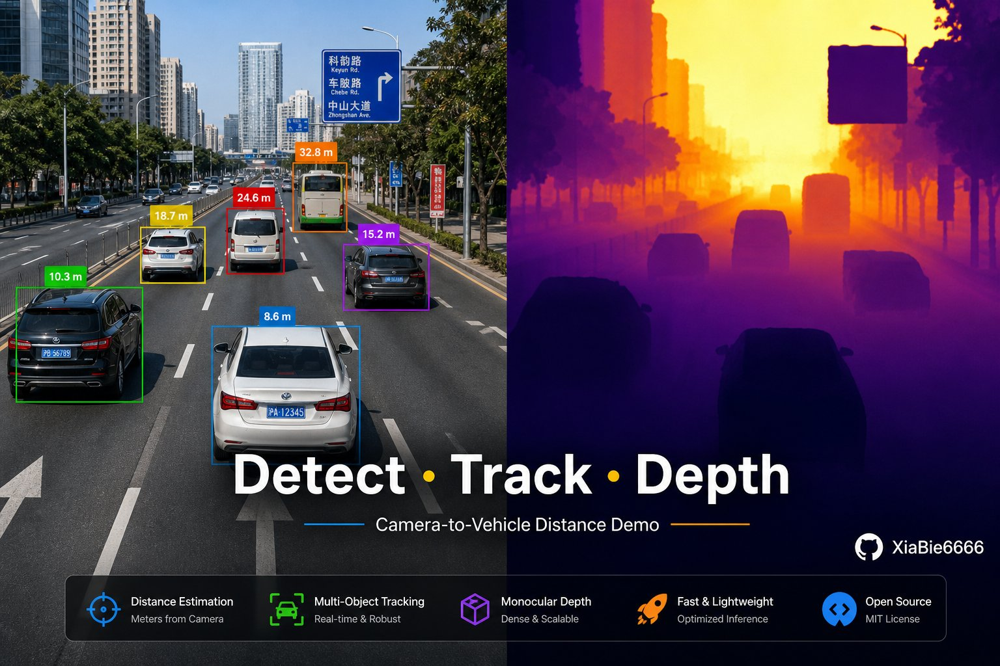
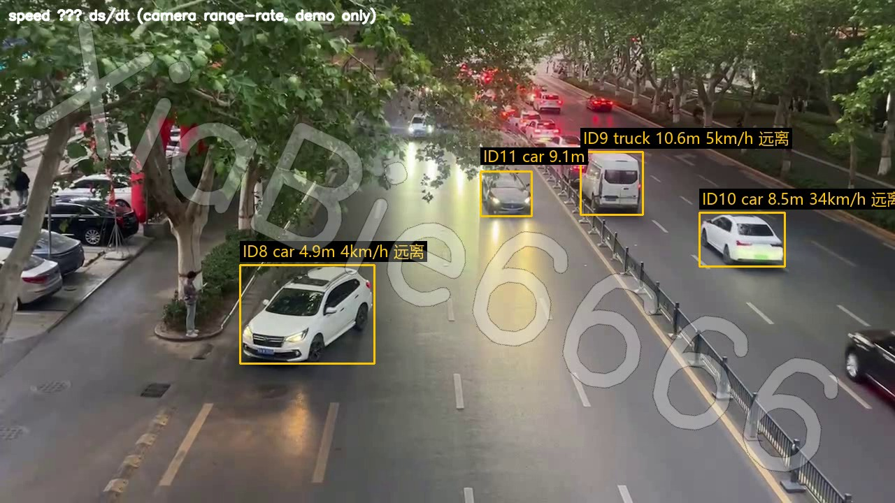
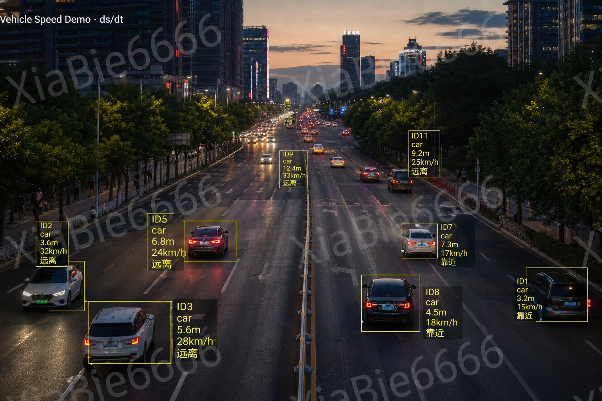
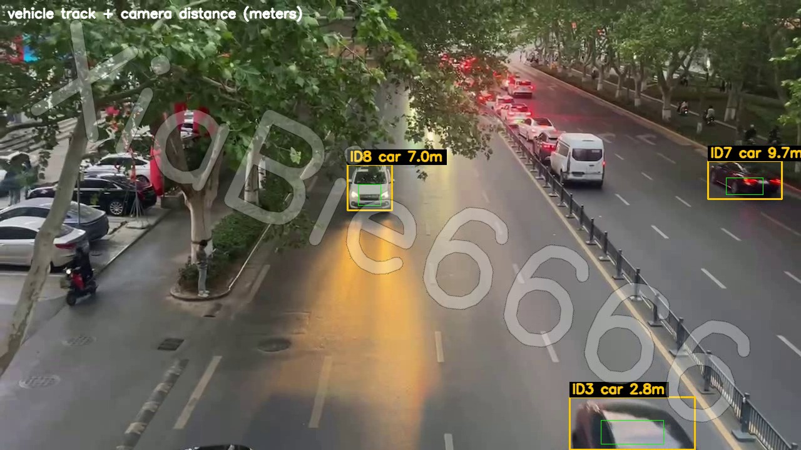
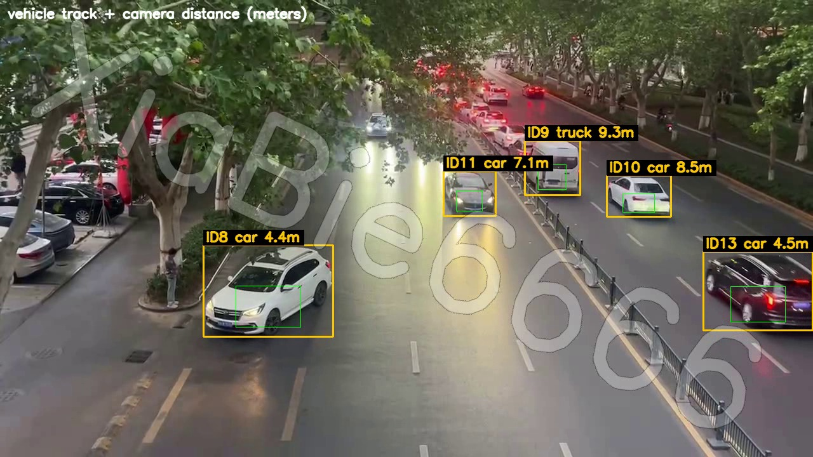
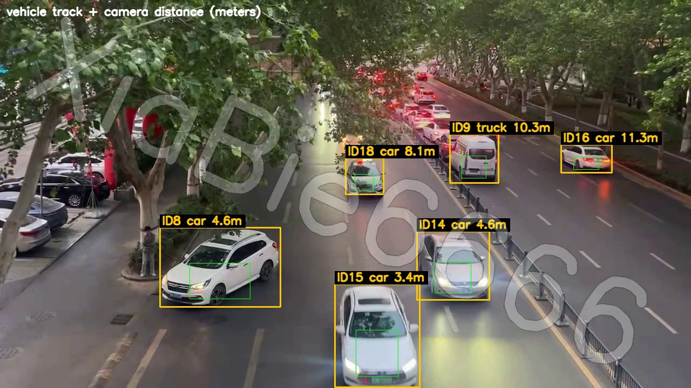
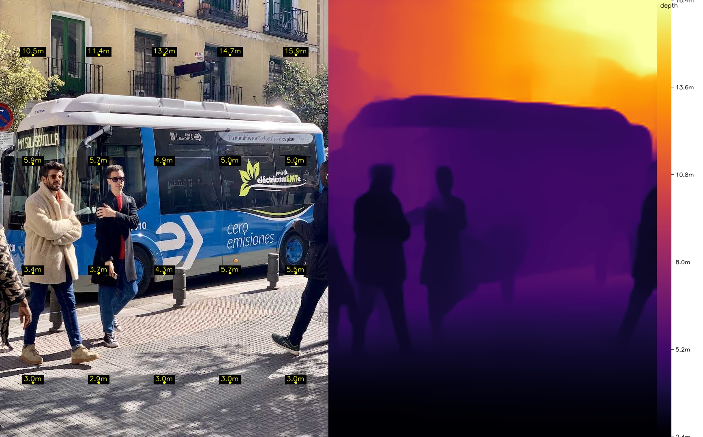
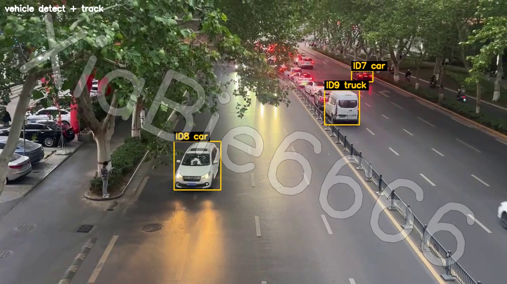
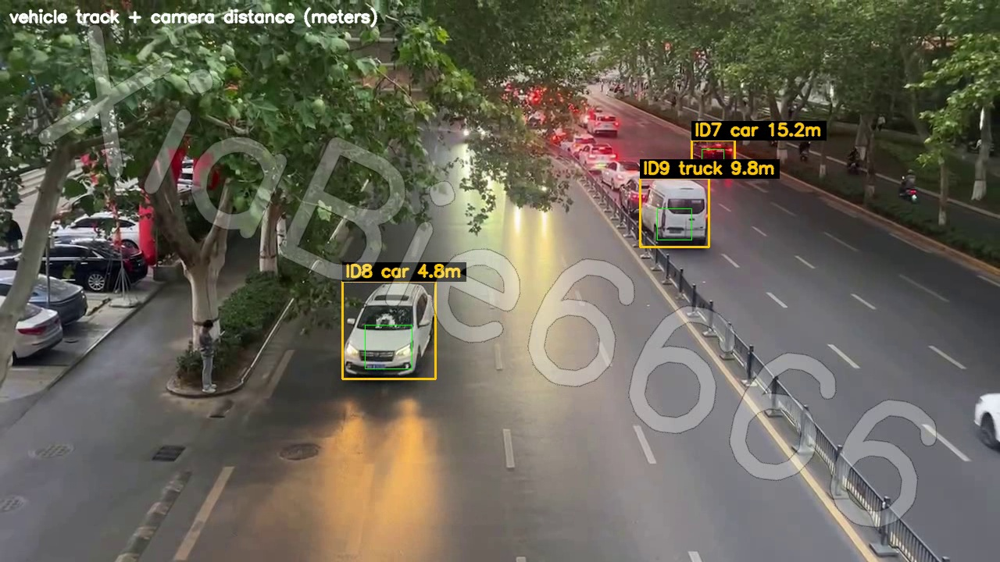
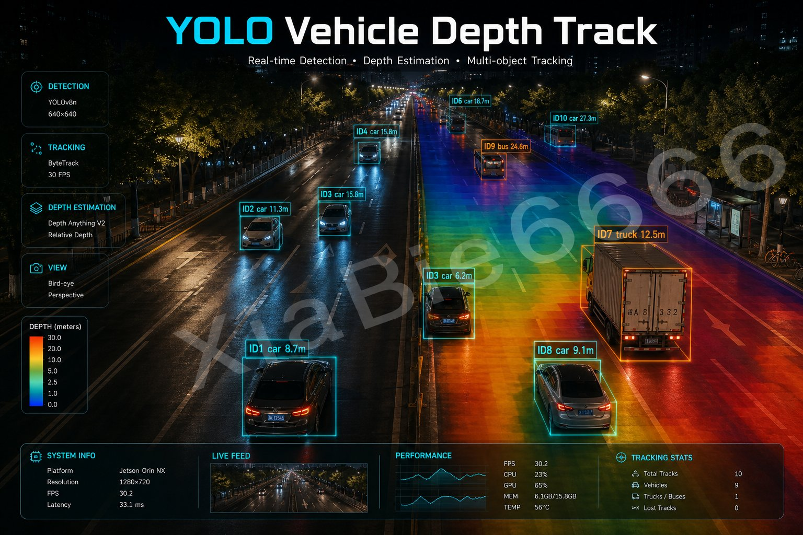

# YOLO Vehicle Depth Track

[English](README.md) | [中文](README_zh.md)

**YOLO26-based vehicle perception demo**: detection + multi-object tracking + monocular ranging + speed estimation in one pipeline.  
Automatically locks onto cars / buses / trucks, keeps stable track IDs, and shows camera-to-vehicle distance plus estimated speed — ready to run out of the box.

> **For**: traffic demos, AI teaching, portfolios, and scaffolding for further development.  
> **Not for**: precise metrology, law enforcement, or safety-critical systems. Monocular depth/speed are estimates, not LiDAR / stereo / official speed guns.

**Repos**

- GitHub: https://github.com/xiabie666/yolo-vehicle-depth-track  
- Gitee: https://gitee.com/xiabieyo/yolo-vehicle-depth-track



## Demo Scene

The sample video is assumed to be captured from:

**Songshan Road overpass, Zhengzhou, Henan, China** (elevated / top-down traffic view)

Used to demonstrate vehicle tracking, ranging, and speed estimation under a typical urban overpass camera angle.

## Preview

### Speed estimation (NEW)

Real frame (distance + speed + approaching / leaving):



Concept poster :



Label example: `ID8 car 4.5m 18km/h 靠近`  
Meaning: tracked vehicle is ~4.5 m from the camera, estimated radial speed ~18 km/h, approaching the camera.

### Distance frames from video

| Frame 1 | Frame 2 | Frame 3 |
|:---:|:---:|:---:|
|  |  |  |

### Module outputs

**1) Monocular depth only**



**2) Detect + track only (IDs)**



**3) Final ranging (track + distance)**



### Concept art 



## Tech Stack

| Module | Tech | Code |
|------|------|----------|
| Depth | YOLO26 Monocular Depth | `depth/` |
| Detect + track | YOLO Detect + ByteTrack | `detect_track/` |
| Ranging | Track boxes + depth sampling | `final/` |
| Speed | Δdistance / Δtime | `speed/` |
| Utils | Watermark / Chinese text draw | `tools/` `common/` |

One line: **YOLO detects & tracks vehicles → monocular depth estimates distance → distance change estimates speed.**

### How speed is computed

```text
speed ≈ Δdistance / Δtime
```

- This is **radial speed relative to the camera** (approaching / leaving), not absolute ground speed on the road.
- Depth is noisy; the script applies sliding-window smoothing. Demo-only accuracy.

## Project Layout

```text
yolo-vehicle-depth-track/
├── depth/              # depth-only demos
│   ├── demo_image.py
│   └── demo_video.py
├── detect_track/       # detect + track only
│   └── demo_video.py
├── final/              # track + distance
│   └── demo_video.py
├── speed/              # track + distance + speed (recommended)
│   └── demo_video.py
├── tools/              # watermark helper
│   └── watermark_video.py
├── common/             # shared paths / classes / watermark / CN text
├── data/               # demo video (watermarked, Songshan Rd overpass)
├── assets/             # README images
├── weights/            # optional local .pt weights
└── outputs/            # run outputs
```

## Quick Start

```bash
pip install -r requirements.txt

# 1) Depth only (image)
python depth/demo_image.py

# 2) Detect + track
python detect_track/demo_video.py

# 3) Ranging: track + distance
python final/demo_video.py

# 4) Speed: track + distance + speed (full pipeline)
python speed/demo_video.py
```

On first run, Ultralytics will download `yolo26n.pt` / `yolo26n-depth.pt` (or place them under `weights/`).

Demo video: `data/video.mp4` (Zhengzhou Songshan Rd overpass demo, watermarked, OK to publish).  
Keep unwatermarked raw footage as `data/video_raw.mp4` (gitignored — do not upload).

## Distance / Speed Meaning

| Item | Meaning |
|------|------|
| Distance from | The camera that captured the frame |
| Distance to | Tracked vehicle surface (lower-center of the box) |
| Speed | Rate of change of that distance (Δd/Δt) |
| Not | Inter-vehicle distance, absolute road speed, or enforcement-grade metering |

## Environment

- Python 3.10+
- Windows / Linux
- GPU recommended (CPU works)
- Chinese on-screen labels use system fonts (e.g. Microsoft YaHei on Windows)

## License

MIT License. Demo video & watermark belong to the author. YOLO / Ultralytics weights follow their own licenses.

## Acknowledgements

- [Ultralytics YOLO](https://github.com/ultralytics/ultralytics)
- YOLO26 Monocular Depth
